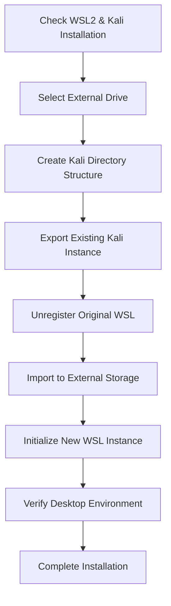

# Kali-Linux WSL2 on External Storage Installer

 


A Windows batch script for moving Kali-Linux WSL2 installation to external storage devices.

## ✨ Features
- Automated WSL2 environment migration
- Supports any external storage device (USB/HDD/SSD)
- Maintains original Kali Linux configuration
- Includes Kali Desktop Experience (kex) setup
- ANSI encoding support

## ⚙️ Prerequisites
1. Windows 10/11 with WSL2 enabled
2. Pre-installed Kali Linux WSL distribution
3. External storage with 10GB+ free space (NTFS/exFAT formatted)

## 🚀 Usage
1. Connect external storage device
2. **Run as Administrator**:   
```bat
run.bat
```
3. Select drive letter (e.g., `E`)
4. Wait for automatic process completion   

## 📝 Important Notes
❗ **Run as Administrator** required  
💾 External storage must use Windows-compatible file system  
🔄 Original WSL instance will be deleted after migration  
⏳ Process takes 5-15 minutes depending on storage speed  

## 🛠️ Technical Details
```bat
@echo off
REM [Script content truncated for readability]
REM Full script available in repository
```

## 📜 Version History
`v1.0` - Initial release (2025-03-02)  
`Maintainer:` Kai_HT  
`Encoding:` ANSI


Markdown file contains proper badge placement and section organization. For actual use, replace placeholder image URLs with real diagrams.
